# My E-Commerce Website

A responsive e-commerce website built using HTML, CSS and JavaScript.

## Features

- Responsive design
- Product listing
- Shopping cart
- Product filtering
- Add to cart functionality
- Local storage

## Technologies Used

- HTML5
- CSS3
- JavaScript
- Git
- GitHub

## Screenshots

- COMPUTER

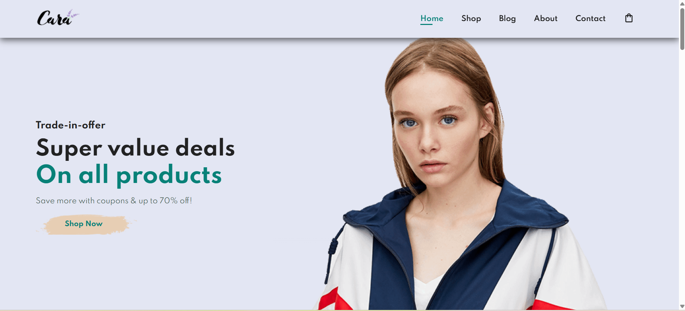
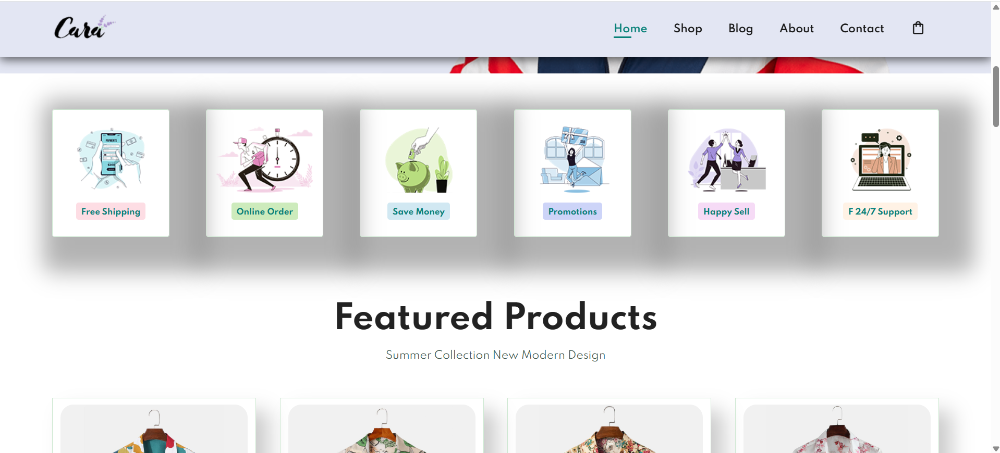
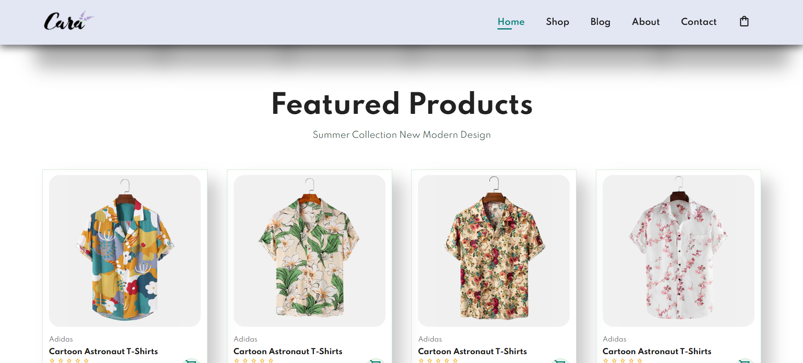
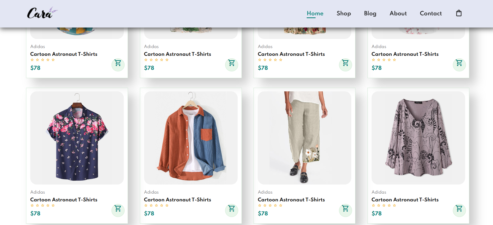

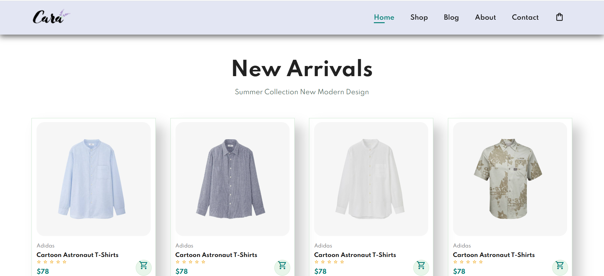
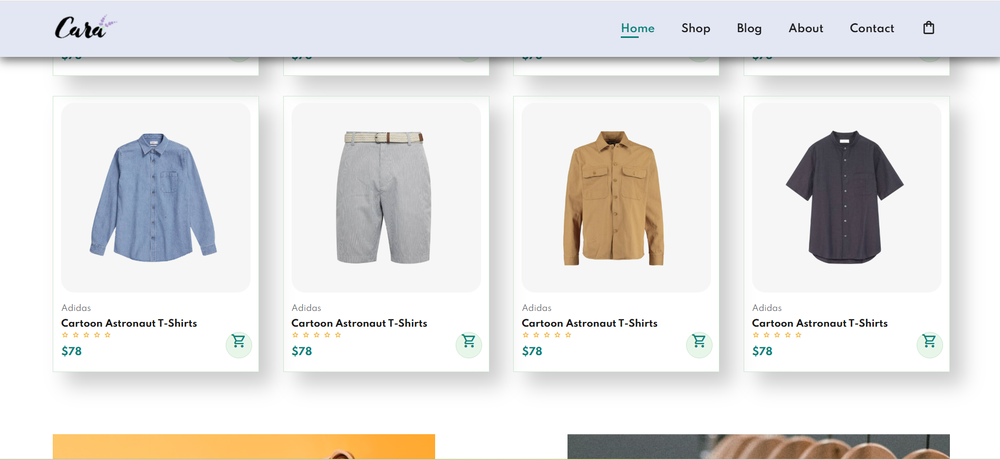

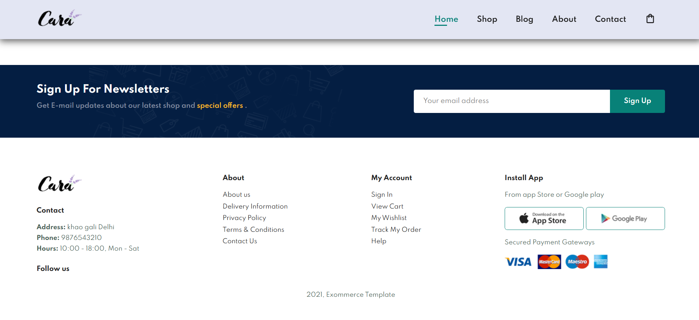

- MOBILE

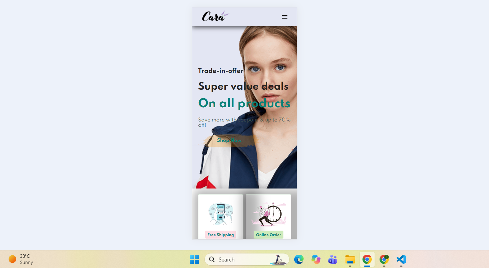
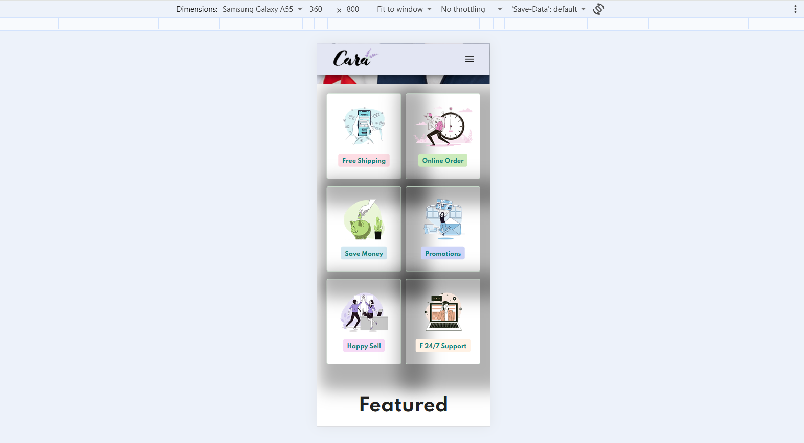
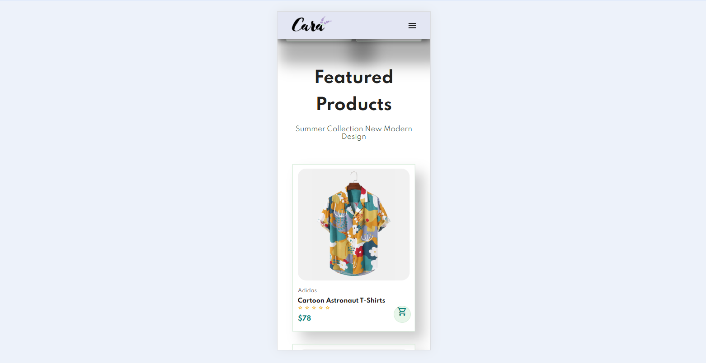
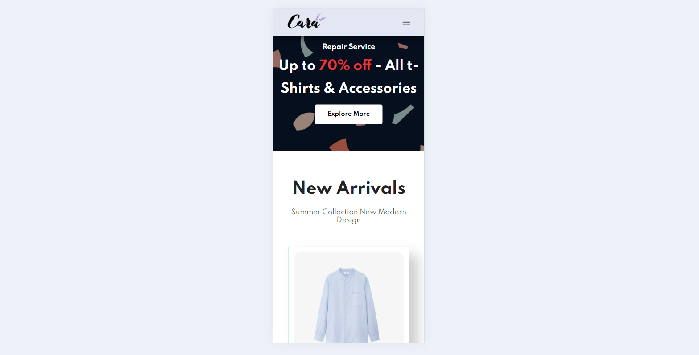
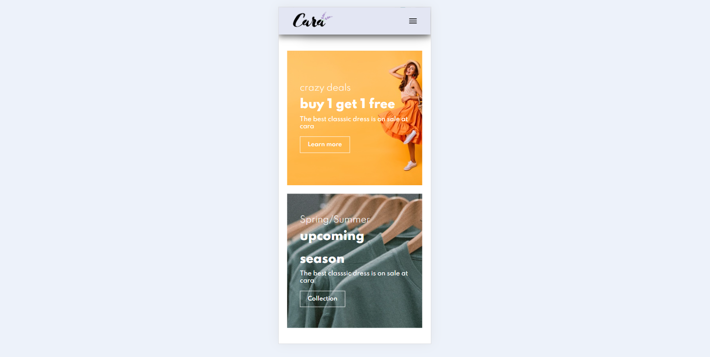
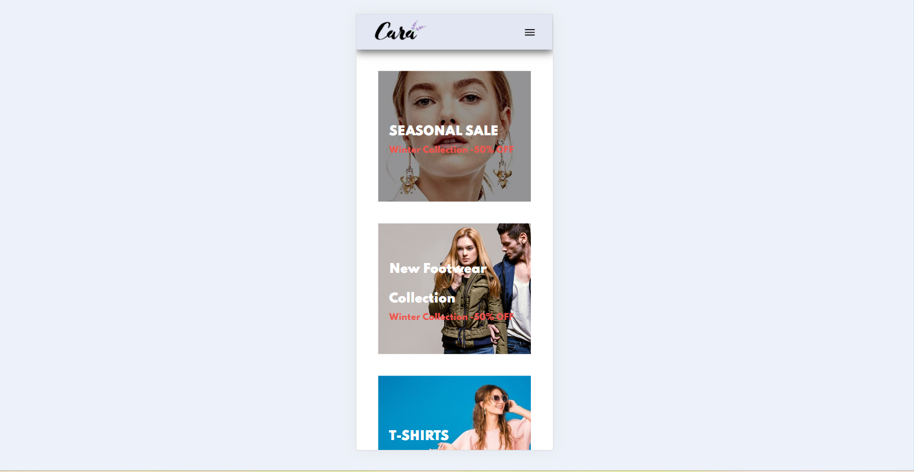
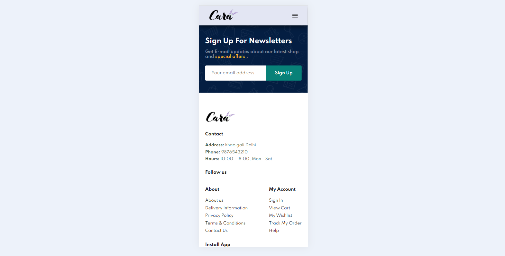
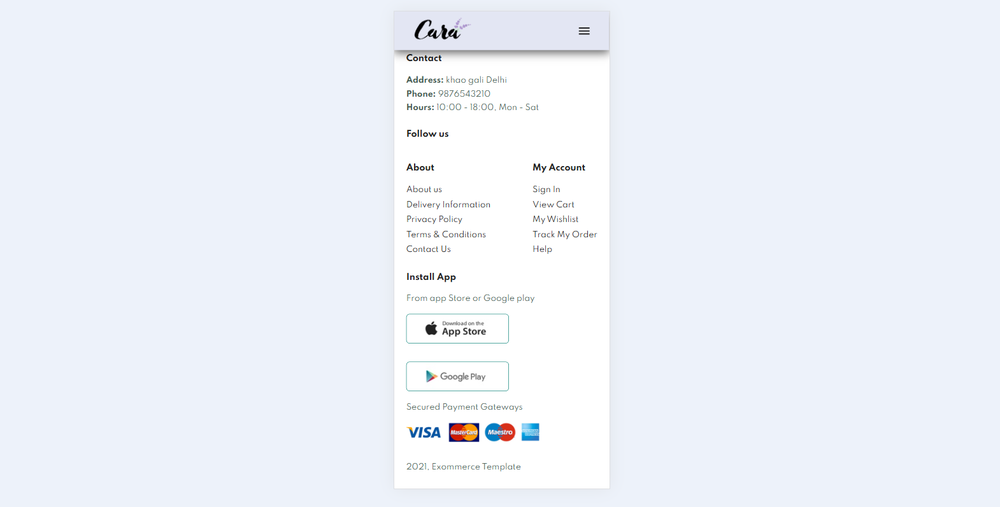

